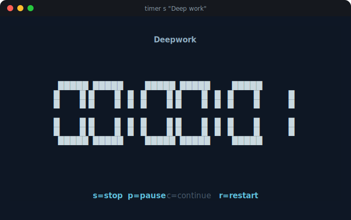
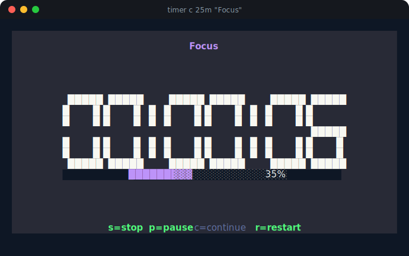
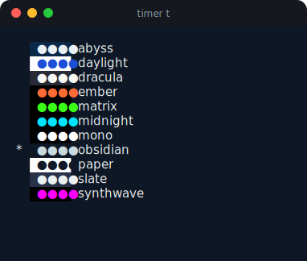
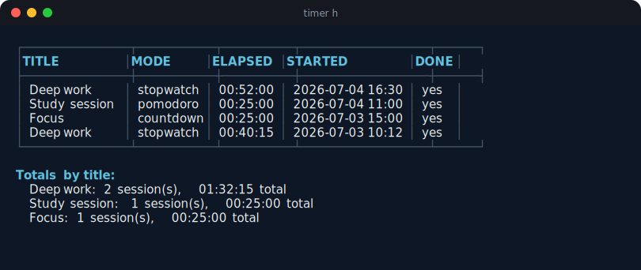

# timer

A beautiful terminal timer: stopwatch, countdown, and pomodoro — with a big centered clock, themes, and session history. Single static binary, works on macOS and Linux.

<p align="center">
  
</p>

## Screenshots

<table>
  <tr>
    <td align="center" width="50%">
      <br>
      <sub><code>timer c 25m "Focus"</code> — dracula theme, progress bar</sub>
    </td>
    <td align="center" width="50%">
      <br>
      <sub><code>timer t</code> — every theme with a live color preview</sub>
    </td>
  </tr>
  <tr>
    <td colspan="2" align="center">
      <br>
      <sub><code>timer h</code> — session history with per-title totals</sub>
    </td>
  </tr>
</table>

## Install / Build

Requires Go 1.25+.

```bash
go build -o timer .
# optionally, put it on your PATH:
mv timer /usr/local/bin/timer
```

## While a timer is running

| Key | Action |
|-----|--------|
| `s` | Stop and save the session to history, then quit |
| `p` | Pause |
| `c` | Continue (resume from pause) |
| `r` | Restart the current timer from zero |
| `q` / `Ctrl+C` | Quit without saving |

When a countdown or pomodoro round reaches zero, timer rings the terminal bell, sends a desktop notification (with a custom timer icon), and shows a "DONE" screen — press any key to dismiss it.

> On macOS, the custom notification icon only appears if [`terminal-notifier`](https://github.com/julienXX/terminal-notifier) is installed (`brew install terminal-notifier`); otherwise notifications fall back to the system default via `osascript`. On Linux the icon shows automatically via D-Bus.

Every command accepts a global `--theme <name>` flag (see [`timer themes`](#timer-themes--t)).

## Commands

### `timer start` / `s`

Starts a stopwatch, counting up from `00:00:00`. Takes an optional title, which is stored with the session in history.

```
timer start ["title"]
```

**Example:**

```bash
timer s "Deep work"
```

### `timer countdown` / `c`

Starts a countdown from the given duration down to zero. The duration comes first, then an optional title.

```
timer countdown <duration> ["title"]
```

Duration accepts Go-style duration syntax (`25m`, `1h`, `1h30m`, `90s`) or a bare number, which is interpreted as minutes.

**Examples:**

```bash
timer c 25m "Focus"
timer c 1h "Study"
timer c 90 "Long break"   # 90 minutes
```

### `timer pomodoro` / `p`

Runs a pomodoro session: alternating work/break countdowns that auto-transition, with a round counter shown in the title. Each completed round is saved to history with mode `pomodoro`.

```
timer pomodoro ["title"] [--work <duration>] [--break <duration>] [--rounds <n>]
```

| Flag | Default | Description |
|------|---------|-------------|
| `--work` | `25m` | Work phase duration |
| `--break` | `5m` | Break phase duration |
| `--rounds` | `4` | Number of work/break rounds |

**Example:**

```bash
timer p "Study session" --work 25m --break 5m --rounds 4
```

### `timer history` / `h`

Shows past timer sessions (newest first) with per-title totals. Supports searching by title, exporting to JSON or CSV, and pagination.

```
timer history [--search <substr>] [--page <n>] [--export json|csv]
```

| Flag | Description |
|------|-------------|
| `--search` | Filter sessions by title substring (case-insensitive) |
| `--page` | Page of results to show, 20 records per page (default `1`) |
| `--export` | Export **all** matching sessions (ignores `--page`) as `json` or `csv` to stdout |

The table shows 20 records at a time so it stays readable even with hundreds of sessions — "Totals by title" always reflects every matching session, not just the current page.

**Examples:**

```bash
timer h
timer h --page 2
timer h --search "Deep"
timer h --export csv > sessions.csv
```

### `timer themes` / `t`

Lists all available color themes with a live color preview. The starred entry is your current default.

```
timer themes
timer themes set <name>
```

**Examples:**

```bash
timer t
timer themes set matrix
```

## Themes

Mostly dark themes, since they're built for black terminals, plus a couple of light ones. Each theme now paints an actual background color, not just colored text on your terminal's own background.

- `obsidian` (default) — deep navy blue-black (`#0E1725`) with soft off-white digits
- `slate` — blue-gray (`#283048`) with bright off-white digits
- `abyss` — deep navy (`#0A2947`) with teal accents
- `dracula` — the classic [Dracula](https://draculatheme.com/) palette
- `midnight` — pure black with cyan
- `matrix` — pure black with green
- `ember` — pure black with orange/red
- `mono` — pure black with white
- `synthwave` — pure black with magenta
- `paper` — white with black text
- `daylight` — white with blue text

Set a default so you don't need `--theme` every time:

```bash
timer themes set dracula
```

Or override per run:

```bash
timer s "Deep work" --theme synthwave
```

## Data locations

Config and history are stored under `$XDG_CONFIG_HOME/timer-cli` (falls back to `~/.config/timer-cli` if `XDG_CONFIG_HOME` is unset):

- `~/.config/timer-cli/config.json` — your default theme
- `~/.config/timer-cli/history.json` — every saved session
